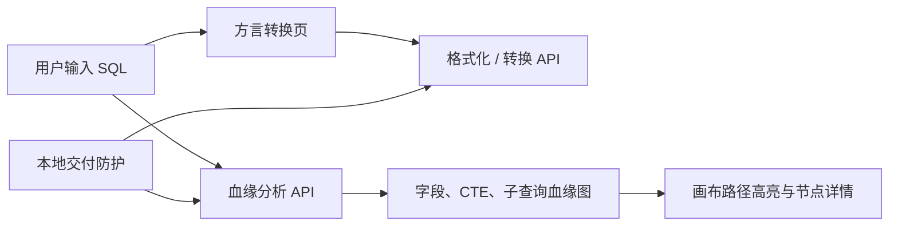

# 最近两轮功能迭代检阅文档

> 检阅范围：`dev` 分支最近两次已提交迭代。  
> 不含当前工作区尚未提交的后续开发内容。  
> 生成日期：2026-07-17

## 一、迭代总览

| 轮次 | 提交 | 时间 | 主题 | 交付结论 |
| --- | --- | --- | --- | --- |
| 第 1 轮 | `60225fd` | 2026-06-18 | 方言转换体验与架构基线 | 转换结果可读性、编辑器操作稳定性、架构文档可检索性提升 |
| 第 2 轮 | `7b5644f` | 2026-06-22 | 本地交付防护与血缘交互收尾 | 本地服务边界收紧，血缘图交互与复杂 SQL 血缘准确性提升 |

两轮累计变更：49 个文件，新增约 1,717 行、删除约 746 行（以提交统计为准）。其中第 1 轮 9 个文件，第 2 轮 40 个文件。

## 二、第 1 轮：方言转换体验与架构基线

### 2.1 用户可见功能

1. SQL 格式化和方言转换输出统一为小写关键字。

   - `select`、`from`、`group by`、`as` 等关键字不再混用大小写。
   - 字符串字面量、注释和标识符中的文本不参与大小写改写，避免把 `'SELECT'` 误改成 `'select'`。
   - 多语句输入仍保持全部语句输出，而非只保留第一条语句。

2. 方言转换页的双编辑器操作更稳定。

   - 分栏拖拽由鼠标事件切换为 Pointer Events，支持指针捕获、取消和丢失捕获的收尾。
   - 编辑区宽度限制在 30%～70%；双击分割条可恢复 50:50；键盘左右方向键可微调。
   - 打开 Diff 时，源 SQL 编辑器与差异覆盖层的宽度计算一致，避免分栏错位。

3. 转换状态区更紧凑、更聚焦。

   - 没有诊断信息时，状态区收敛为单行提示，不再显示空白诊断卡片区域。
   - 有风险或诊断时，优先展示风险摘要和具体诊断，便于判断转换结果是否可直接使用。

### 2.2 后端与工程改动

- 在 `format_controller.py` 新增关键字安全小写化处理：按 SQL 词法边界扫描，跳过单行注释、块注释、单/双/反引号字符串。
- 扩充格式化 API 集成测试，覆盖多语句保留、关键字小写化与字符串字面量保护。
- 初始化并规范 `.codegraph` 索引目录管理，移除陈旧守护进程文件。
- 新增项目架构说明 `docs/ARCHITECTURE.md`：包含三张 Mermaid 图及模块地图。
- 新增架构债务清单 `docs/待优化/architecture_debt.md`：记录三个孤立服务模块及后续治理方向。

### 2.3 验证覆盖

- 后端：`backend/tests/integration/test_format_api.py`
  - 多语句格式化完整保留；
  - SQL 关键字统一小写；
  - 字符串字面量不被改写。
- 前端：`frontend/src/pages/__tests__/DialectConvertPage.test.tsx`
  - 空状态紧凑展示；
  - 双编辑器/Diff 模式；
  - Pointer 拖拽调整分栏。

### 2.4 检阅重点

- 小写化策略目前是展示层规范：应确认团队是否需要保留源 SQL 原始大小写的可选模式。
- 方言转换的完整正确性仍依赖 SQLGlot 支持范围；页面已展示诊断，但诊断分级策略可继续产品化。

## 三、第 2 轮：本地交付防护、血缘交互与解析准确性

### 3.1 本地交付与服务安全边界

1. 后端仅面向本机访问。

   - 新增 `LocalDeliveryGuardMiddleware`，拒绝非 loopback 客户端。
   - Trusted Host 白名单仅接受 `127.0.0.1`、`localhost` 和测试环境 `testserver`。
   - CORS 从任意来源改为仅允许本机 Origin，且不再允许携带凭证。

2. SQL 请求具备资源保护。

   - 请求体上限 2 MB；SQL 文本上限 64 KiB。
   - `/api/sql/analyze`、`/api/sql/convert`、`/api/sql/format` 单并发执行，忙碌时返回 429。
   - SQL 请求超时阈值为 30 秒，超时返回 504。

3. 格式化和转换接口改为同步函数。

   - 与当前以本地单并发保护为前提的执行模型对齐，减少无必要的异步接口包装。

### 3.2 血缘解析准确性

1. 修复 `LATERAL VIEW` / `explode` 字段血缘。

   - 从 AST 中精确提取横向展开输出字段与表达式输入字段的依赖关系。
   - 只处理当前 `SELECT` 作用域，避免外层查询错误吸收内层横向展开依赖。
   - `amount_item` 这类 explode 输出可正确追溯到 `refund_amount` 等原始字段。
   - 删除旧的正则兜底和“猜测式回填”逻辑，改为统一的 schema 依赖写入路径。

2. 派生关系 schema 构建收敛。

   - `derived_relation_schema_builder` 复用独立的 LATERAL VIEW 依赖提取器。
   - 横向展开字段以 `lateral_view` 转换类型、medium 置信度入库，并去重输入字段。

### 3.3 血缘图交互与前端运行稳定性

1. 工具栏更聚焦正式功能。

   - Subquery、Table、Column 保留为一线视图切换。
   - Semantics、Diagnostics 迁入“Experimental”下拉入口，减少主工具栏噪声。
   - 移除重复的诊断抽屉快捷入口，避免与实验视图/详情入口并列造成歧义。

2. 字段级选中路径的视觉反馈增强。

   - 上游路径使用蓝色箭头，下游影响范围使用橙色箭头。
   - 选中字段后，相关上游/下游列在关系节点内获得明确高亮。
   - 画布连线按列级端点而非仅按节点端点判断，提升折叠关系节点和列容器场景下的准确性。

3. Monaco 编辑器支持本地交付。

   - 增加本地 Monaco 装载与 Provider 适配，浏览器冒烟脚本改为访问受控全局实例 `__SQL_LINEAGE_MONACO__`。
   - 减少对外部运行时全局 `window.monaco` 的隐式依赖，提升离线/本地环境可复现性。

4. 方言转换页继续收尾。

   - 统一转换页不同编辑/比较模式的状态与测试。
   - 优化“复制目标 SQL”操作的视觉反馈和可用性。

### 3.4 验证覆盖

- 本地交付：
  - `backend/tests/test_local_delivery_guards.py`：回环地址识别、SQL 长度、请求体大小、并发繁忙和超时；
  - `backend/tests/integration/test_local_delivery_api.py`：Host 白名单与本地/远程 CORS 行为。
- 血缘解析：
  - `backend/tests/test_lateral_view_dependency_extractor.py`：横向展开输入输出映射及嵌套作用域隔离；
  - `backend/tests/test_derived_relation_schema_builder.py`：CTE 中 `LATERAL VIEW explode` 到物理字段的追溯。
- 前端：
  - `frontend/src/components/__tests__/CanvasToolbar.test.tsx`；
  - `frontend/src/components/__tests__/LineageCanvas.test.tsx`；
  - `frontend/src/components/SqlEditor/__tests__/localMonaco.test.ts`；
  - `frontend/src/pages/__tests__/DialectConvertPage.test.tsx`；
  - `frontend/e2e/lineage_browser_smoke.py`。

### 3.5 检阅重点

- 本轮的“仅本机交付”是明确的部署边界：如未来需要容器、局域网或公网部署，必须重新设计认证、代理信任链、并发与超时策略，不能直接放宽白名单。
- 单并发 SQL 执行保障了本地稳定性，但大量批量分析场景会排队；如产品定位变化，需要引入任务队列和资源隔离。
- LATERAL VIEW 已覆盖 AST 可解析的主路径；复杂嵌套函数或方言扩展仍应持续补充 Golden Case。

## 四、影响关系

## 五、当前工作区说明（不纳入上述两轮）

截至本文生成时，工作区另有一批未提交的后续开发：19 个已跟踪文件变更，另有 3 组新增测试/工具文件。该批改动涉及复杂 SQL 的 CTE/子查询/集合运算血缘、DDL 空图降级、注释分号脚本拆分、输出字段命名，以及画布路径遍历重构。

它们尚未形成提交，因此本检阅文档没有将其标记为“已交付”。建议在提交并完成回归后另立 C20 文档，避免交付边界混淆。

## 六、检阅结论

这两轮形成了三项明确成果：

1. 方言转换从“能用”进一步提升到输出一致、编辑稳定、风险可见；
2. SQL 血缘工作台在复杂 SQL（尤其横向展开）和字段选中反馈上的可信度更高；
3. 产品交付边界收紧为可控的本地工具，架构与已知债务有了可审阅的基线。

建议本次检阅优先确认两项产品决策：是否长期维持“仅本机交付”，以及实验视图是否继续保留在正式产品入口中。
