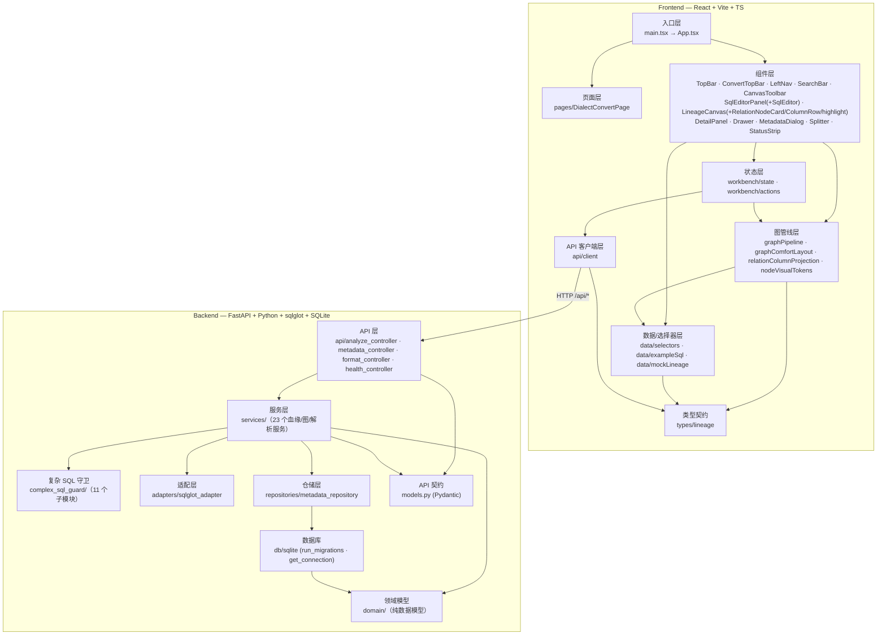
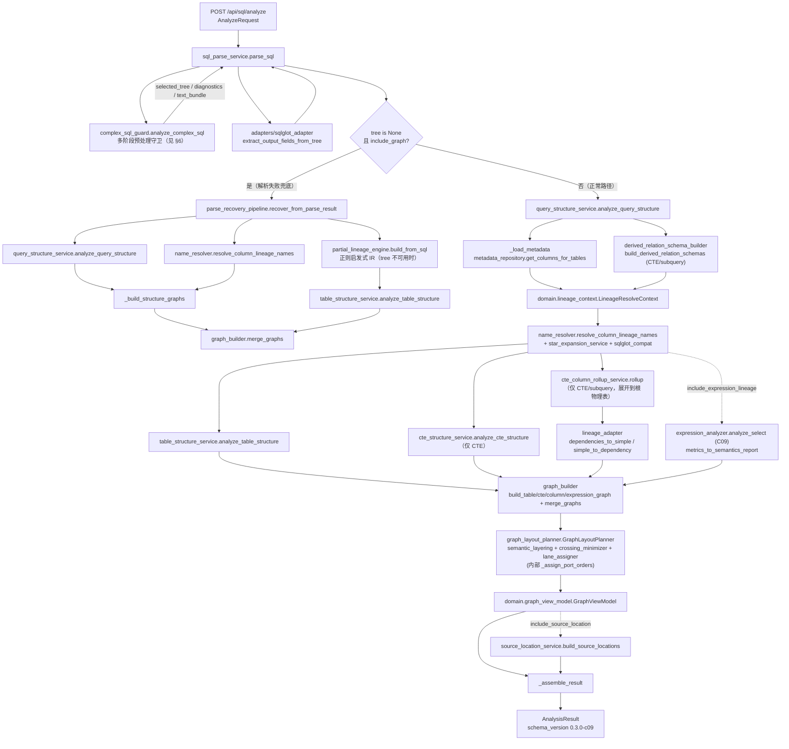
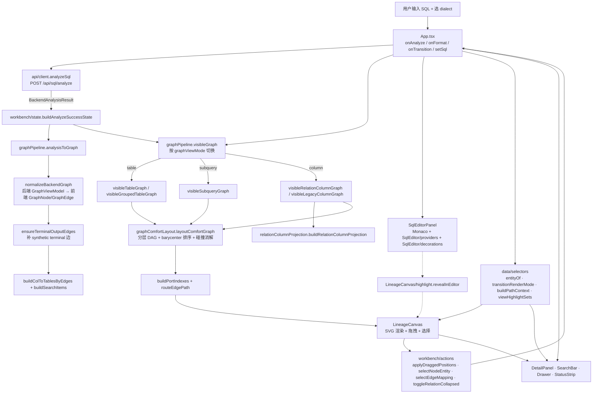

# SQL Lineage Visualization V1 — 整体架构

> 基于 codegraph v1.0.1 索引（275 文件 / 3,203 节点 / 8,232 边）与源码依赖分析生成。
> 覆盖范围：主代码 `backend/` + `frontend/`。版本：backend `0.3.0-c09`。

项目目标（`最终目标.md`）：以 **sqlglot + Python + SQLite** 为核心提供后端血缘解析能力，导入元数据到 SQLite 维护；前端以 **在线 SQL 编辑器 + 画布血缘点线图** 为核心，支持拖拽、表达式/子查询级分析、口径展示与字段注释接入；各模块高内聚低耦合、便于扩展与排障。

---

## 1. 技术栈

| 层 | 技术 |
|---|---|
| 后端 | FastAPI · Pydantic · sqlglot · SQLite (WAL) · tree-sitter（仅 codegraph 自身） |
| 前端 | React · TypeScript · Vite · Monaco Editor · Tailwind · Vitest |
| 接口 | HTTP JSON，前缀 `/api`，CORS 全开 |
| 索引 | codegraph 本地 SQLite 知识图（`.codegraph/`，开发者工具，非运行时依赖） |

---

## 2. 系统总览（分层架构）



**分层规则**
- 前端：`入口 → 页面/组件 → 状态 → 图管线 → 选择器/数据 → API → 类型`。状态层（`workbench/`）是唯一改写 `WorkbenchState` 的地方；图管线（`graphPipeline`）只做纯函数变换；组件不直接调 API，通过 `App.tsx` 回调驱动。
- 后端：`api → services → (adapters / complex_sql_guard / repositories) → domain / models`。`domain/` 是纯数据模型，无副作用；`models.py` 是 Pydantic API 契约；`db/` 只暴露连接与迁移。

---

## 3. 后端核心管线 — `POST /api/sql/analyze`

`analyze_controller.analyze` 是整个项目的核心编排器，串起解析 → 结构 → 血缘 → 图 → 布局 → 装配。



**关键编排点（`analyze_controller.py:35-294`）**
1. `parse_sql` 先跑守卫管线拿 `tree`，再用 adapter 抽 output_fields。
2. `tree is None` 且要图 → 走 `ParseRecoveryPipeline`；仍无 tree → `PartialLineageEngine` 正则启发式 + `table_structure` 兜底，`status=partial`、`confidence.lineage=0.4`。
3. 正常路径：`analyze_query_structure` 只跑一次，`metadata` 仅按 `physical_table_names` 加载，CTE/subquery schema 由 `derived_relation_schema_builder` 补。
4. CTE 优先：有 CTE 时 `table_structure` 只为 final SELECT 的物理表构建；CTE 结构图单独建；列血缘经 `CteColumnRollupService` rollup 到根物理表。
5. 图合并后由 `GraphLayoutPlanner` 做 semantic rank / lane / crossing / port order；`ExpressionAnalyzer`（C09）可选追加表达式节点；`source_location` 可选。
6. `capabilities` / `confidence` / `diagnostics` 统一在 `_assemble_result` 收口，输出 `AnalysisResult`。

---

## 4. 前端图管线 — 从用户输入到画布渲染



**关键设计点**
- **单一状态源**：`WorkbenchState`（`types/lineage.ts`）只在 `workbench/state.ts`（生命周期）与 `workbench/actions.ts`（交互）中产出新状态，组件通过 `setState` 派发。
- **图管线是纯函数**：`graphPipeline.ts` 把 `BackendAnalysisResult` → `GraphLike`（`analysisToGraph`）→ `visibleGraph`（按 `graphViewMode` 切视图）→ `layoutComfortGraph`（布局）→ `buildPortIndexes` + `routeEdgePath`（布线）。无副作用，便于测试。
- **三种视图模式**：`table`（表级，>8 张表自动分组为虚拟源组）、`subquery`（表/CTE/子查询级）、`column`（列级，`relation_rows` 走 `relationColumnProjection`，`legacy` 走折叠列图）。
- **编辑器 ↔ 画布双向**：画布双击节点 → `revealInEditor`（`LineageCanvas/highlight`）在 Monaco 定位；编辑器光标实体变化 → `handleCursorEntityChange` 更新 `selectedEntity`。

---

## 5. 跨边界接口契约

| 端点 | 方法 | 前端调用 (`api/client.ts`) | 后端 handler | 请求体 / 响应体 (`models.py`) |
|---|---|---|---|---|
| `/api/health` | GET | `getHealth` | `health_controller.health_check` | → `{status, service, version}` |
| `/api/sql/analyze` | POST | `analyzeSql` | `analyze_controller.analyze` | `AnalyzeRequest` → `AnalysisResult` |
| `/api/sql/format` | POST | `formatSql` | `format_controller.format_sql` | `FormatSqlRequest` → `FormatSqlResponse` |
| `/api/sql/convert` | POST | `convertSql` | `format_controller.convert_sql` | `ConvertSqlRequest` → `ConvertSqlResponse` |
| `/api/metadata/import/preview` | POST | `previewMetadata` | `metadata_controller.import_preview` | `MetadataImportRequest` → `MetadataImportResponse` |
| `/api/metadata/import/commit` | POST | `commitMetadata` | `metadata_controller.import_commit` | `MetadataImportRequest` → `MetadataImportResponse` |
| `/api/metadata/tables` | GET | `listMetadataTables` | `metadata_controller.list_tables` | → `MetadataTablesResponse` |
| `/api/metadata/columns` | GET | `listMetadataColumns` | `metadata_controller.list_columns` | `?table=` → `MetadataColumnsResponse` |

**核心响应体 `AnalysisResult`**（`models.py`）：`schema_version=0.3.0-c09` · `status(success/partial/failed)` · `confidence_level` · `confidence{parse,lineage}` · `graph_view_model{nodes,edges,layout_hint}` · `output_fields` · `source_locations` · `diagnostics_report` · `stage_statuses` · `unsupported_features` · `capabilities` · `summary` · `semantics_report` · `normalized_sql` · `analysis_sql` · `sql_text_bundle` · `preflight_report` · `segments` · `parse_attempts`

**图节点类型**（`GraphNode.node_type`）：`table` · `physical_column` · `cte` · `subquery` · `output_column`/`output_field` · `expression` · `output`
**图边类型**（`GraphEdge.edge_type`）：`column_lineage` · `table_to_result` · `table_to_cte` · `cte_dependency` · `cte_to_result` · `subquery_to_result` · `subquery_dependency` · `projection` · `alias` · `output_column_to_result` · `expression`

---

## 6. 模块清单与职责

### Backend `backend/app/`

**API 层** `api/` — FastAPI router，薄编排
- `analyze_controller.py` — `/sql/analyze`，核心管线编排（537 行）
- `metadata_controller.py` — `/metadata/*`，元数据导入预览/提交 + 查询
- `format_controller.py` — `/sql/format`、`/sql/convert`，sqlglot transpile + 方言归一 + 关键字大小写还原 + 风险函数诊断
- `health_controller.py` — `/health`

**服务层** `services/`（23 模块，按职责分组）
- *解析与守卫*：`sql_parse_service`（`parse_sql` 入口）、`parse_recovery_pipeline`（解析失败兜底）、`sqlglot_compat`（跨版本兼容助手）
- *结构分析*：`query_structure_service`（CTE/子查询/物理表名一次性提取）、`table_structure_service`、`cte_structure_service`
- *血缘解析*：`name_resolver`（`resolve_column_lineage_names` 主入口，依赖 `star_expansion_service` + `sqlglot_compat`）、`star_expansion_service`（`SELECT *` 展开）、`partial_lineage_engine`（无 tree 时的正则启发式 IR）、`cte_column_rollup_service`（CTE 列血缘 rollup 到根物理表）、`lineage_adapter`（`simple_to_dependency` / `dependencies_to_simple` 转换）
- *schema 推导*：`derived_relation_schema_builder`（CTE/subquery 派生关系 schema）
- *表达式分析 (C09)*：`expression_analyzer`（SELECT 投影表达式依赖，无 LLM）、`expression_dependency_extractor`、`lateral_view_dependency_extractor`（Lateral View AST 输出列到输入列映射）
- *图构建与布局*：`graph_builder`（`build_column/cte/table/expression_graph` + `merge_graphs`）、`graph_layout_planner`（编排布局，内部 `_assign_port_orders`）、`graph_crossing_minimizer`、`graph_semantic_layering`（`SemanticLayerAssigner` + `LaneAssigner`，按 node_type 分配 rank/lane）、`graph_port_order_optimizer`（字段行排序实验实现；主管线尚未提供字段端口数据契约）
- *源定位*：`source_location_service`
- *元数据*：`metadata_import_service`（`preview` / `commit`，走 `metadata_repository`）

**复杂 SQL 守卫** `complex_sql_guard/`（11 子模块）— `sql_parse_service` 的预处理管线
- `analyzer.py`（`ComplexSqlAnalyzer` / `analyze_complex_sql` 入口）、`preflight`、`normalizer`、`script_cleaner`、`segmenter`、`parser_adapter`、`dialect`、`feature_tagger`、`diagnostics`、`shields`、`models`

**适配层** `adapters/sqlglot_adapter.py` — sqlglot AST → output_fields 抽取，隔离 sqlglot 版本细节

**仓储层** `repositories/metadata_repository.py` — SQLite 元数据读写（`version_exists`、`import_metadata`、`list_tables`、`get_columns`、`get_columns_for_tables`）

**领域模型** `domain/`（纯数据，无副作用）
- `lineage_context.py`（`LineageResolveContext`）、`lineage_model.py`（`SimpleColumnLineage`）、`graph_view_model.py`（`GraphModel`/`GraphNode`/`GraphEdge`）、`graph_layout_models.py`（`LayoutConfig`/`LayoutNode`/`LayoutEdge`/`LayoutResult`）、`cte_rollup_models.py`、`metadata_model.py`（`TableMeta`/`ColumnMeta`）、`diagnostics_model.py`（诊断码常量）

**数据库** `db/sqlite.py` — `run_migrations` + `get_connection`（WAL）

**API 契约** `models.py` — Pydantic 模型（`AnalyzeRequest`/`AnalysisOptions`/`AnalysisResult`/`GraphViewModel`/`Diagnostic`/`DiagnosticsReport`/`OutputField`/`FormatSql*`/`ConvertSql*`/`Metadata*`）

### Frontend `frontend/src/`

**入口** `main.tsx` → `App.tsx`（202 行）— 顶层状态编排、页面切换（workbench/convert）、回调绑定

**页面** `pages/DialectConvertPage.tsx` — 方言转换页

**组件** `components/`
- 外壳：`TopBar`、`ConvertTopBar`、`LeftNav`、`StatusStrip`、`Splitter`、`Drawer`
- 编辑器：`SqlEditorPanel` + `SqlEditor/providers`（Monaco 语言/补全）+ `SqlEditor/decorations`（高亮装饰）
- 画布：`LineageCanvas`（561 行，SVG 渲染 + 拖拽 + 视口）+ `LineageCanvas/RelationNodeCard`、`LineageCanvas/ColumnRow`、`LineageCanvas/highlight`（`revealInEditor`）
- 交互：`SearchBar`、`CanvasToolbar`、`DetailPanel`、`MetadataDialog`

**状态** `workbench/`
- `state.ts` — `initialWorkbenchState` + 生命周期变换（`applySqlDraftChange` / `buildAnalyzeRunningState` / `buildAnalyzeSuccessState` / `buildAnalyzeFailureState` / `applySearchSelection`），`buildAnalyzeSuccessState` 调 `graphPipeline.analysisToGraph`
- `actions.ts` — 交互变换（`selectNodeEntity` / `selectEdgeMapping` / `applyDraggedPositions` / `switchGraphViewMode` / `toggleRelationCollapsed` / `resetViewport` 等，纯函数）

**图管线**（顶层模块，纯函数）
- `graphPipeline.ts`（703 行）— `normalizeBackendGraph` / `ensureTerminalOutputEdges` / `analysisToGraph` / `visibleGraph`（按 `graphViewMode` 分派）/ `layoutLayeredDag` / `buildPortIndexes` / `routeEdgePath`
- `graphComfortLayout.ts`（360 行）— `layoutComfortGraph` 分层 DAG + barycenter 排序 + 碰撞消解
- `relationColumnProjection.ts` — 列视图的关系-列投影
- `nodeVisualTokens.ts` — 节点几何尺寸常量（`COMFORT_CANVAS` / `RELATION_NODE_GEOMETRY` / `getComfortNodeBox`）

**数据/选择器** `data/`
- `selectors.ts` — `entityOf` / `entityName` / `transitionRenderMode` / `buildPathContext` / `currentEntitySet` / `viewHighlightSets` / `diagnosticsForEntity`
- `exampleSql.ts`、`mockLineage.ts`

**API 客户端** `api/client.ts` — 8 个端点封装，`normalizeDialect`，统一 `request<T>` 错误处理

**类型契约** `types/lineage.ts`（299 行）— `WorkbenchState` / `GraphNode` / `GraphEdge` / `BackendAnalysisResult` / `Entity` / `SearchItem` / `SourceLocation` / `EdgeMapping` 等

**工具** `utils/cx.ts` — className 合并

---

## 7. 关键数据流（端到端）

```
用户在 Monaco 输入 SQL
  → App.onAnalyze
  → api/client.analyzeSql  ──POST /api/sql/analyze──▶  analyze_controller.analyze
        ▼ 后端管线（§3）
        sql_parse_service → complex_sql_guard → adapters/sqlglot_adapter
        → query_structure_service → metadata_repository → derived_relation_schema_builder
        → name_resolver (+ star_expansion + sqlglot_compat) → cte_column_rollup_service → lineage_adapter
        → graph_builder → graph_layout_planner (+ crossing_minimizer + semantic_layering + lane_assigner)
        → [expression_analyzer (C09)] → [source_location_service]
        → _assemble_result → AnalysisResult (GraphViewModel + diagnostics + capabilities)
  ◀───── HTTP JSON ─────
  → workbench/state.buildAnalyzeSuccessState
        ▼ 前端图管线（§4）
        graphPipeline.analysisToGraph → normalizeBackendGraph → ensureTerminalOutputEdges
        → visibleGraph (table/subquery/column) → graphComfortLayout.layoutComfortGraph
        → buildPortIndexes + routeEdgePath
  → LineageCanvas 渲染 SVG（节点 = RelationNodeCard/ColumnRow，边 = 路径）
  → DetailPanel / SearchBar / Drawer / StatusStrip 联动
  → 用户拖拽节点 → workbench/actions.applyDraggedPositions → 重渲染
  → 用户双击节点 → LineageCanvas/highlight.revealInEditor → Monaco 定位
```

---

## 8. 其他目录（架构图未展开，均为开发产物/待集成）

| 目录 | 性质 | 说明 |
|---|---|---|
| `c09_c10_design_core_code/` | 设计核心代码 | C09/C10 阶段的 patch 文件 + golden cases + `expression_analyzer`/`semantics_models` 设计版，部分已合入主代码 |
| `complex_sql_handling_package/` | 交付包 | 复杂 SQL 处理能力的设计与实现包 |
| `sql_lineage_comfort_layout_refactor_package/` | 重构包 | 前端 comfort 布局重构交付（对应 `graphComfortLayout.ts`） |
| `sql_lineage_graph_fix_agent_package/` | 重构包 | 图构建/边锚定修复交付 |
| `sql_lineage_graph_visual_refactor_package/` | 重构包 | 图可视化重构交付 |
| `review_packages/` | 评审包 | `complex_sql_guard_review_20260606` 等 |
| `docs/` | 文档 | 多个设计/重构交付文档（`cte_expression_schema_refactor_pack`、`sql_lineage_orchestrator_refactor_pack` 等） |
| `golden_cases/` | 测试金标准 | C10 golden cases |
| `测试用例/` | 测试用例 | SQL 血缘测试输入 |
| `data/` | 数据 | 元数据/示例数据 |

> 这些目录是开发过程的历史交付与待集成代码，不参与运行时架构；主代码以 `backend/` + `frontend/` 为准。

---

## 9. 如何用 codegraph 深入探索

索引已就绪（`.codegraph/`，275 文件 / 3203 节点 / 8232 边）。在 opencode 新会话中 codegraph MCP 会自动加载，可用：

- `codegraph_explore "analyze_controller graph_builder name_resolver"` — 一次拿核心编排链路源码
- `codegraph_callers graph_layout_planner` — 确认布局器被谁调用
- `codegraph_node "parse_sql"` — 看 `sql_parse_service.parse_sql` 完整源码 + 调用者
- `codegraph_search "ExpressionAnalyzer"` — 定位 C09 表达式分析器

CLI 等价：`codegraph explore "<symbols>"`、`codegraph callers <symbol>`、`codegraph node <symbol>`、`codegraph query <name>`。
