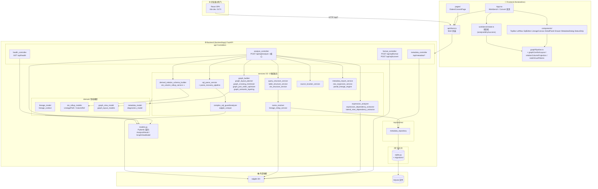
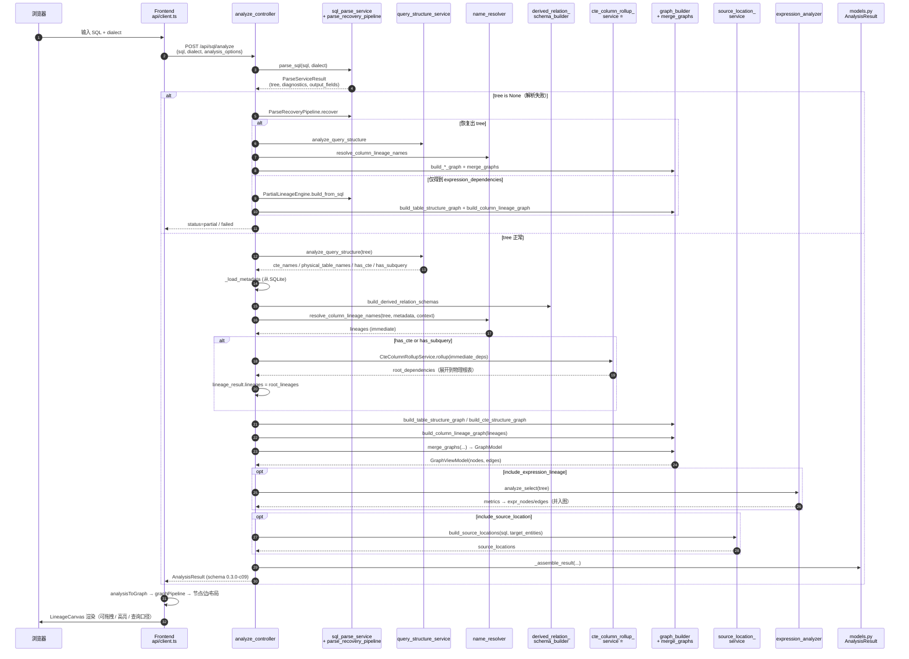

# SQL 血缘解析可视化 V1 — 项目整体架构图

> 版本：`0.3.0-c09`  
> 技术栈：FastAPI + sqlglot ≥30 + SQLite ｜ React 19 + TypeScript + Vite + Monaco + Tailwind  
> 生成时间：2026-06-18

---

## 一、分层总览（Mermaid）



---

## 二、ASCII 精简版（纯文本环境备用）

```
┌──────────────────────────── 浏览器 ────────────────────────────┐
│  React SPA  (Vite dev :5173 / vite build → dist)              │
└───────────────┬────────────────────────────────────────────────┘
                │ fetch /api/*
┌───────────────▼──── Frontend  (frontend/src) ───────────────────┐
│  App.tsx ─┬─ Workbench 工作台页                                  │
│           │   ├─ TopBar / LeftNav / SearchBar / CanvasToolbar   │
│           │   ├─ SqlEditorPanel  (Monaco)                       │
│           │   ├─ LineageCanvas  (SVG 画布 / 拖拽 / 高亮)         │
│           │   ├─ DetailPanel / Drawer / StatusStrip             │
│           │   └─ MetadataDialog                                  │
│           └─ Convert 方言转换页 (DialectConvertPage)             │
│  workbench/state.ts ─ 状态机                                    │
│  graphPipeline.ts ─ graph → 节点/边/布局/投影/视觉令牌           │
│  api/client.ts ─ HTTP 封装                                       │
└───────────────┬─────────────────────────────────────────────────┘
                │
┌───────────────▼──── Backend  (backend/app)  FastAPI ────────────┐
│  api/  Controllers                                             │
│   ├─ GET  /api/health                                          │
│   ├─ POST /api/sql/analyze   ⭐ 核心血缘分析                    │
│   ├─ POST /api/sql/format    /  POST /api/sql/convert           │
│   └─ POST /api/metadata/import/{preview,commit}                 │
│      GET  /api/metadata/{tables,columns}                       │
│                                                                 │
│  services/  (高内聚 25 模块)                                    │
│   ├─ sql_parse_service ─→ parse_recovery_pipeline               │
│   ├─ query_structure_service / table_structure_service          │
│   │  / cte_structure_service                                    │
│   ├─ name_resolver / lineage_rollup_service                     │
│   ├─ derived_relation_schema_builder                            │
│   │  / cte_column_rollup_service ⭐ CTE 根源展开                │
│   ├─ expression_analyzer / expression_dependency_extractor      │
│   │  / lateral_view_dependency_extractor                        │
│   ├─ graph_builder / graph_layout_planner                       │
│   │  / graph_crossing_minimizer / graph_port_order_optimizer    │
│   │  / graph_semantic_layering                                  │
│   ├─ source_location_service                                    │
│   ├─ metadata_import_service / star_expansion_service           │
│   │  / partial_lineage_engine                                   │
│   └─ complex_sql_guard/analyzer / sqlglot_compat                │
│                                                                 │
│  domain/   lineage_model · lineage_context                      │
│            cte_rollup_models (LineagePath/ColumnRef)            │
│            graph_view_model · graph_layout_models               │
│            metadata_model · diagnostics_model                   │
│                                                                 │
│  repositories/  metadata_repository                             │
│  db/   sqlite.py + migrations/  ──→  SQLite 文件                │
│  models.py  Pydantic 契约 (AnalysisResult / GraphViewModel)     │
└───────────────┬─────────────────────────────────────────────────┘
                │
┌───────────────▼──── 外部依赖 ───────────────────────────────────┐
│  sqlglot ≥30   (parse / transpile / dialect)                   │
│  SQLite        (元数据存储)                                     │
└─────────────────────────────────────────────────────────────────┘
```

---

## 三、核心请求流：`POST /api/sql/analyze`



---

## 四、数据契约（前后端稳定接口）

| 端点 | 请求 | 响应 |
|---|---|---|
| `GET /api/health` | — | `{status, service, version}` |
| `POST /api/sql/analyze` | `AnalyzeRequest` | `AnalysisResult` (含 `graph_view_model`、`diagnostics_report`、`source_locations`、`semantics_report`、`summary`、`capabilities`) |
| `POST /api/sql/format` | `{sql, dialect}` | `FormatSqlResponse` |
| `POST /api/sql/convert` | `{sql, source_dialect, target_dialect, pretty}` | `ConvertSqlResponse` |
| `POST /api/metadata/import/preview` / `commit` | `MetadataImportRequest` | `MetadataImportResponse` |
| `GET /api/metadata/tables` | — | `MetadataTablesResponse` |
| `GET /api/metadata/columns?table_name=` | — | `MetadataColumnsResponse` |

**契约版本**：`schema_version = "0.3.0-c09"`，定义于 `backend/app/models.py`。

---

## 五、模块职责矩阵（高内聚低耦合）

| 层 | 目录 | 职责 | 依赖方向 |
|---|---|---|---|
| 表现层 | `frontend/src/components` `pages` | UI 渲染、交互、拖拽 | → workbench → api/client |
| 状态层 | `frontend/src/workbench` | Workbench 状态机：empty/ready/analyzing/analyzed/dirty/failed | → graphPipeline |
| 图渲染层 | `frontend/src/graphPipeline.ts` 等 | 后端 GraphViewModel → 节点/边/布局/投影 | → api/client |
| 接入层 | `frontend/src/api/client.ts` | fetch 封装、dialect 归一化 | → Backend API |
| 接口层 | `backend/app/api` | 路由、请求校验、组装响应 | → services / models |
| 应用层 | `backend/app/services` | 解析、结构、血缘、rollup、图构建、源码定位 | → domain / repositories |
| 领域层 | `backend/app/domain` | 领域模型：`LineagePath`、`ColumnRef`、`GraphModel` | （无外部依赖） |
| 持久层 | `backend/app/repositories` `db` | SQLite 元数据读写 + 迁移 | → SQLite |
| 契约层 | `backend/app/models.py` | Pydantic DTO，前后端稳定边界 | （被 api/services 共用） |

---

## 六、关键扩展点

- **解析容错**：`parse_recovery_pipeline` + `partial_lineage_engine` —— 即使 sqlglot 完全解析失败，仍可基于结构事实返回 `partial` 血缘。
- **CTE 根源展开**：`cte_column_rollup_service` —— 将 CTE/子查询的即时血缘沿 `DerivedRelationSchema` 递归展开到物理根表，并产出 `LineagePath` 与诊断。
- **图工程化**：`graph_builder` + `graph_layout_planner` + `graph_crossing_minimizer` + `graph_port_order_optimizer` + `graph_semantic_layering` —— 后端已做布局/交叉最小化/端口排序，前端 `graphPipeline` + `graphComfortLayout` 再做舒适化渲染。
- **方言转换**：`format_controller` 支持 spark/hive/starrocks，含风险函数检测（`RISKY_FUNCTIONS_BY_TARGET`）与源大小写保留（`CASE_PRESERVED_WORDS`）。
- **元数据闭环**：`MetadataDialog` → `metadata_import_service` (preview/commit) → SQLite → `metadata_repository` → `analyze` 时通过 `_load_metadata` 回灌列信息。

---

## 七、辅助目录（非运行时）

| 目录 | 用途 |
|---|---|
| `c09_c10_design_core_code/` `complex_sql_handling_package/` | 阶段设计/参考实现 |
| `docs/` | 迭代文档、契约、架构审查、交付包 |
| `golden_cases/` `测试用例/` `data/` | 黄金用例与测试数据 |
| `review_packages/` | 历次代码评审快照 |
| `frontend/e2e/` | Python 驱动的浏览器冒烟测试（`browser-harness`） |
